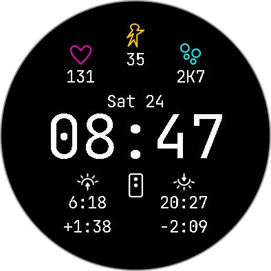

# Connect IQ Lab

Sandbox for Connect IQ projects.

## Face 1 (Watch Face)

-   Source: [Face1/](Face1/)
-   Hard-coded dimensions for `Vivoactive 5` (390x390px round face)
-   Project was initialized with
    -   Connect IQ SDK `v7.1.1`
    -   App Type: Watch Face simple
    -   `minApiLevel="3.1.0"`
-   Not suitable for "Always On"
-   Font: `JetBrains Mono`, generated with BMFont
    -   Font Size: `115px` (Main Clock)
    -   Font Size: `32px` (Data Texts)
